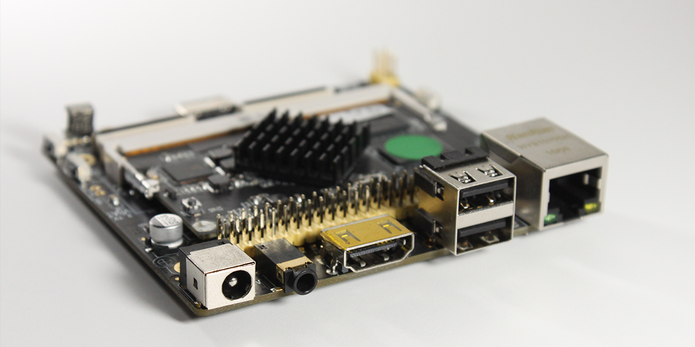
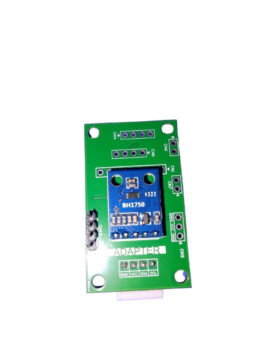
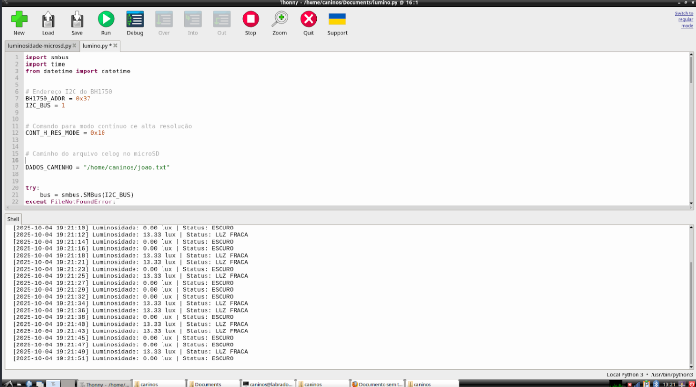

# Datalogger de Luminosidade BH1750

Este projeto implementa um datalogger de luminosidade usando Python e o sensor BH1750 via barramento I2C. O sistema monitora a intensidade luminosa em tempo real, classifica os níveis de luz e salva todas as leituras em arquivo `.txt` para análises futuras. O projeto é indicado para uso acadêmico, experimental ou para monitoramento ambiental contínuo.

---

## Tecnologias e Ferramentas

**Python**  
Linguagem utilizada para desenvolvimento do script de aquisição e registro de dados.

**SMBus / I2C**  
Protocolo de comunicação que permite a interação com o sensor BH1750.

**BH1750**  
Sensor digital capaz de medir a intensidade luminosa em lux com precisão.

**Arquivo `.txt`**  
Armazena todas as leituras realizadas, incluindo status de luminosidade e registros de erro.

---

---

## Componentes

**Labrador 32**  
 

**Sensor BH1750**

---

## Funcionalidades

- **Monitoramento Contínuo**  
  Leitura do sensor BH1750 a cada 2 segundos.

- **Registro com Data e Hora**  
  Cada linha no arquivo contém timestamp, valor em lux e status da luminosidade.

- **Classificação da Luminosidade**  
  - ESCURO: < 5 lux  
  - LUZ FRACA: 5–50 lux  
  - LUZ NORMAL: 50–500 lux  
  - LUZ FORTE: 500–15000 lux  
  - LUZ MUITO FORTE: > 15000 lux

- **Tratamento de Erros**  
  Leituras inválidas ou falhas no sensor são registradas no arquivo.

---

##Registro 

